## **NovaChat – Real-Time Messaging App**

NovaChat, modern full-stack geliştirme pratikleri kullanılarak hazırlanmış gerçek zamanlı bir mesajlaşma uygulamasıdır.
Socket.IO, Redis, MongoDB ve React üzerine inşa edilmiştir.

### 🚀 **Features**

* Real-time DM & grup sohbetleri
* Online/offline takip
* Typing indicator
* Mesaj silme ve düzenleme
* JWT tabanlı kimlik doğrulama
* Dosya gönderme
* Redis ile presence yönetimi
* Docker Compose ile tek komut deploy

---

### 🛠️ **Tech Stack**

* **Frontend:** React, Tailwind
│   │   ├── config/
[](https://github.com/bahattinyunus/NovaChat-Real-Time-Messaging-App/actions/workflows/ci.yml) [](https://codecov.io/gh/bahattinyunus/NovaChat-Real-Time-Messaging-App) [](LICENSE)

# NovaChat — Real-Time Messaging App


<p align="center">
  
</p>

Bu repo, proje fikrini göstermek ve hızlıca yerel veya Docker tabanlı geliştirme yapmanızı sağlamak için sade, çalışır bir örnek içerir.

## İçindekiler

- [Öne Çıkanlar](#öne-çıkanlar)
- [Canlı Başlangıç (Docker)](#canlı-başlangıç-docker)
- [Yerel Geliştirme (Docker olmadan)](#yerel-geliştirme-docker-olmadan)
- [Kısa API & Socket Dokümantasyonu](#kısa-api--socket-dokümantasyonu)
- [WebSocket Örneği (Client)](#websocket-örneği-client)
- [Proje Yapısı](#proje-yapısı)
- [Ortam Değişkenleri](#ortam-değişkenleri)
- [Güvenlik Notları](#güvenlik-notları)
- [Katkıda Bulunma](#katkıda-bulunma)
- [License](#license)

## Öne Çıkanlar

- Basit, çalışır `backend` + `frontend` scaffold.
- Gerçek zamanlı ileti: `Socket.IO`.
- Mesajlar MongoDB'ye kaydedilir (`mongoose`).
- JWT tabanlı auth: `/api/auth/register` ve `/api/auth/login`.
- Frontend'de login/register + token saklama + chat UI.

## Canlı Başlangıç (Docker)

Önerilen yol: Docker Compose ile tüm servisleri ayağa kaldırın.

```powershell
cd "c:\github repolarım\NovaChat – Real-Time Messaging App"
docker compose up --build
```

- Frontend: http://localhost:3000
- Backend API: http://localhost:5000/api

<p align="center">
  
</p>

## Yerel Geliştirme (Docker olmadan)

1) Backend:

```powershell
cd "c:\github repolarım\NovaChat – Real-Time Messaging App\backend"
npm install
npm start
```

2) Frontend:

```powershell
cd "c:\github repolarım\NovaChat – Real-Time Messaging App\frontend"
npm install
npm run dev
```

> Not: Mesaj kalıcılığı için MongoDB gereklidir; Docker kullanmıyorsanız yerel MongoDB çalıştırın veya bağlantınızı `MONGO_URI` ile ayarlayın.

## Kısa API & Socket Dokümantasyonu

- GET `/api/hello` — Sağlık kontrolü.
- GET `/api/messages` — Son 50 mesajı döner.
- POST `/api/auth/register` — Kayıt. Body: `{ "username": "", "password": "" }` — Dönen: `{ token, user }`.
- POST `/api/auth/login` — Giriş. Body: `{ "username": "", "password": "" }` — Dönen: `{ token, user }`.

Socket.IO davranışı:

- Bağlanırken token gönderin: `io(url, { auth: { token } })`.
- Gönderme: `socket.emit('chat:message', { text: 'Merhaba' })`.
- Dinleme: `socket.on('chat:message', (msg) => ...)` — sunucudan yayınlanan `{ id, text, from, ts }` şekli.

### Örnek: curl ile auth & mesajlar

```bash
# Kayıt
curl -X POST http://localhost:5000/api/auth/register -H "Content-Type: application/json" -d '{"username":"alice","password":"secret"}'

# Giriş
curl -X POST http://localhost:5000/api/auth/login -H "Content-Type: application/json" -d '{"username":"alice","password":"secret"}'

# Mesajları al (token varsa Authorization header ekleyin)
curl http://localhost:5000/api/messages
```

## WebSocket Örneği (Client)

```js
import { io } from 'socket.io-client'

const token = localStorage.getItem('token') // veya bir değişkenden alın
[](https://github.com/bahattinyunus/NovaChat-Real-Time-Messaging-App/actions/workflows/ci.yml) [](https://codecov.io/gh/bahattinyunus/NovaChat-Real-Time-Messaging-App) [](LICENSE)

# NovaChat — Real-Time Messaging App

<p align="center">
  
</p>

Minimal, çalışır bir NovaChat scaffold — Express + Socket.IO + MongoDB (backend) ve Vite + React (frontend) ile örnek bir real-time chat uygulaması.

## İçindekiler

- [Öne Çıkanlar](#öne-çıkanlar)
- [Canlı Başlangıç (Docker)](#canlı-başlangıç-docker)
- [Yerel Geliştirme (Docker olmadan)](#yerel-geliştirme-docker-olmadan)
- [Kısa API & Socket Dokümantasyonu](#kısa-api--socket-dokümantasyonu)
- [WebSocket Örneği (Client)](#websocket-örneği-client)
- [Proje Yapısı](#proje-yapısı)
- [Ortam Değişkenleri](#ortam-değişkenleri)
- [Güvenlik Notları](#güvenlik-notları)
- [Katkıda Bulunma](#katkıda-bulunma)
- [License](#license)

## Öne Çıkanlar

- Basit, çalışır `backend` + `frontend` scaffold.
- Gerçek zamanlı ileti: `Socket.IO`.
- Mesajlar MongoDB'ye kaydedilir (`mongoose`).
- JWT tabanlı auth: `/api/auth/register` ve `/api/auth/login`.
- Frontend'de login/register + token saklama + chat UI.

## Canlı Başlangıç (Docker)

Önerilen yol: Docker Compose ile tüm servisleri ayağa kaldırın.

```powershell
cd "c:\github repolarım\NovaChat – Real-Time Messaging App"
docker compose up --build
```

- Frontend: http://localhost:3000
- Backend API: http://localhost:5000/api

<p align="center">
  
</p>

## Yerel Geliştirme (Docker olmadan)

1) Backend:

```powershell
cd "c:\github repolarım\NovaChat – Real-Time Messaging App\backend"
npm install
npm start
```

2) Frontend:

```powershell
cd "c:\github repolarım\NovaChat – Real-Time Messaging App\frontend"
npm install
npm run dev
```

> Not: Mesaj kalıcılığı için MongoDB gereklidir; Docker kullanmıyorsanız yerel MongoDB çalıştırın veya bağlantınızı `MONGO_URI` ile ayarlayın.

## Kısa API & Socket Dokümantasyonu

- GET `/api/hello` — Sağlık kontrolü.
- GET `/api/messages` — Son 50 mesajı döner.
- POST `/api/auth/register` — Kayıt. Body: `{ "username": "", "password": "" }` — Dönen: `{ token, user }`.
- POST `/api/auth/login` — Giriş. Body: `{ "username": "", "password": "" }` — Dönen: `{ token, user }`.

Socket.IO davranışı:

- Bağlanırken token gönderin: `io(url, { auth: { token } })`.
- Gönderme: `socket.emit('chat:message', { text: 'Merhaba' })`.
- Dinleme: `socket.on('chat:message', (msg) => ...)` — sunucudan yayınlanan `{ id, text, from, ts }` şekli.

### Örnek: curl ile auth & mesajlar

```bash
# Kayıt
curl -X POST http://localhost:5000/api/auth/register -H "Content-Type: application/json" -d '{"username":"alice","password":"secret"}'

# Giriş
curl -X POST http://localhost:5000/api/auth/login -H "Content-Type: application/json" -d '{"username":"alice","password":"secret"}'

# Mesajları al (token varsa Authorization header ekleyin)
curl http://localhost:5000/api/messages
```

## WebSocket Örneği (Client)

```js
import { io } from 'socket.io-client'

const token = localStorage.getItem('token') // veya bir değişkenden alın
const socket = io('http://localhost:5000', { auth: { token } })

socket.on('connect', () => console.log('connected', socket.id))
socket.on('chat:message', (m) => console.log('msg', m))

// gönder
socket.emit('chat:message', { text: 'Selam dünya' })
```

## Proje Yapısı

```
├── backend/
│   └── src/
│       ├── index.js          # app + socket.io + mongo connect
│       ├── models/
│       │   ├── message.js
│       │   └── user.js
│       ├── routes/
│       │   └── auth.js
│       └── middleware/
│           └── auth.js
├── frontend/
│   └── src/
│       └── App.jsx           # login/register + chat UI
├── docker-compose.yml
├── .env.example
└── README.md
```

## Ortam Değişkenleri

- `PORT` — backend port (default `5000`)
- `MONGO_URI` — MongoDB URI (ör: `mongodb://mongo:27017/novachat`)
- `REDIS_URL` — Redis URL (scaffold hazır)
- `JWT_SECRET` — JWT gizli anahtar (üretimde güçlü bir değer kullanın)

## Güvenlik Notları

- Bu repo demo amaçlıdır. Üretim için eklemeniz gerekenler:
  - Input validasyonu ve sanitizasyon
  - Rate limiting
  - HTTPS zorunluluğu ve güvenli cookie/CSRF koruması
  - Güçlü `JWT_SECRET` ve oturum yönetimi

## Katkıda Bulunma

Bakınız: `CONTRIBUTING.md` — küçük, odaklı PR'lar gönderin; test ekleyin ve açıklayıcı commit mesajları yazın.

## Lisans

Bu proje MIT lisansı ile dağıtılmaktadır — daha fazla bilgi için `LICENSE` dosyasına bakın.

