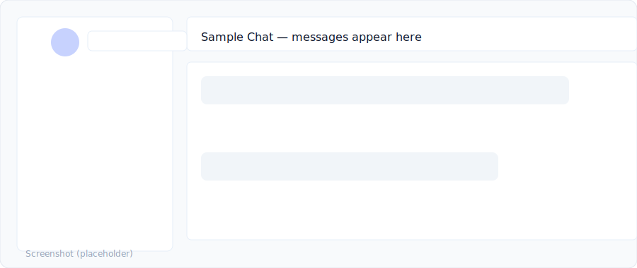

<!--
	README: Full rewrite for NovaChat project
	- Completely new, project-focused, Turkish-language README
	- Contains badges, quick start, API & Socket examples, testing/CI notes, env vars, security, contribution
-->

[](https://github.com/bahattinyunus/NovaChat-Real-Time-Messaging-App/actions/workflows/ci.yml) [](https://codecov.io/gh/bahattinyunus/NovaChat-Real-Time-Messaging-App) [](LICENSE)

# NovaChat — Real‑Time Messaging App


NovaChat, öğrenme ve hızlı prototipleme amacıyla hazırlanmış, gerçek‑zamanlı mesajlaşma özellikleri barındıran bir full‑stack scaffold uygulamasıdır. Bu repo; backend, frontend, gerçek‑zaman katmanı, temel auth ve Docker Compose ile tek komutla çalıştırılabilecek bir yerel ortam içerir.

## Ekran Görüntüleri & Demo

- Aşağıda proje içinde bulunan bazı görseller ve animasyon yer alır. Bu dosyalar `assets/` klasöründen yüklenir.

- Demo animasyon: uygulama akışını gösterir.


- Uygulama arayüzünden bir ekran görüntüsü (placeholder).



Not: Gerçek ekran görüntülerini isterseniz bana gönderin veya `frontend` klasöründeki çalışır örnekten yüksek çözünürlüklü ekran görüntüleri alıp README'ye ekleyeyim.

---

## Assets & Optimizasyon

Projede kullanılan görseller `assets/` klasöründe bulunur. Mevcut SVG dosyalarının minify edilmiş versiyonları da `assets/*.min.svg` olarak eklendi. Eğer PNG / WebP gibi raster fallbacks isterseniz, yerel olarak SVG'den dönüştürmek için aşağıdaki adımları takip edin:

1. `sharp` paketini kurun (global değil proje içinde tercih edilir):

```powershell
cd "C:\github repolarım\NovaChat – Real-Time Messaging App"
npm install sharp
```

2. SVG'leri PNG/WebP'ye dönüştürün:

```powershell
node tools/generate-raster-images.js
```

Bu script `assets/` içinde `logo.png`, `logo.webp`, `screenshot-placeholder.png` vb. dosyalar oluşturacaktır.

GIF / Video demo eklemek isterseniz:

- Basit bir rehber: frontend uygulamasını çalıştırıp (veya bir ekran kaydı oluşturarak) `ffmpeg` ile MP4 veya GIF üretebilirsiniz:

```powershell
# 5 saniyelik ekran kaydı örneği (Windows):
# (manuel olarak çalıştırılacak bir GUI kayıt aracı kullanmak genelde daha pratiktir.)

# ffmpeg ile MP4 -> GIF örneği (önce MP4 kaydedin):
ffmpeg -i demo.mp4 -vf "fps=15,scale=900:-1:flags=lanczos" -loop 0 demo.gif
```

Eğer isterseniz ben bu repo için bir `demo.mp4`/`demo.gif` placeholder oluşturup README'ye ekleyebilirim; ancak gerçek uygulama görüntüleri sizin tarafınızdan ya da repository'de çalıştırılarak kaydedilmelidir (ben remote ortamda ekran görüntüsü alamıyorum).

Ana hedefler

- Hızlı başlangıç: minimal ama çalışır bir backend + frontend iskeleti.
- Gerçek‑zamanlı altyapı: Socket.IO ile mesajlaşma, presence ve bildirim akışı.
- Kolay geliştirilebilir: MongoDB ile mesajların kalıcılığı, JWT ile basit auth.

---

## İçindekiler

- [Hızlı Başlangıç (Docker)](#hızlı-başlangıç-docker)
- [Yerel Geliştirme (Docker olmadan)](#yerel-geliştirme-docker-olmadan)
- [API & WebSocket (kısa)](#api--websocket-kısa)
- [Örnekler: curl & Socket.IO](#örnekler-curl--socketio)
- [Testler ve CI](#testler-ve-ci)
- [Ortam Değişkenleri](#ortam-değişkenleri)
- [Proje Yapısı](#proje-yapısı)
- [Güvenlik Notları](#güvenlik-notları)
- [Katkıda Bulunma](#katkıda-bulunma)
- [Lisans](#lisans)

---

## Hızlı Başlangıç (Docker)

1. Depoyu klonlayın ve köke gidin:

```powershell
git clone https://github.com/bahattinyunus/NovaChat-Real-Time-Messaging-App.git
cd "NovaChat – Real-Time Messaging App"
```

2. Docker Compose ile tüm servisleri ayağa kaldırın:

```powershell
docker compose up --build
```

- Frontend: `http://localhost:3000`
- Backend API: `http://localhost:5000/api`

Animasyonlu demo README başında gösterilir; uygulama çalışırken benzer bir akışı frontend üzerinde gözlemleyebilirsiniz.

---

## Yerel Geliştirme (Docker olmadan)

Backend ve frontend’i ayrı ayrı geliştirmek isterseniz:

Backend

```powershell
cd backend
npm install
npm run dev
```

Frontend

```powershell
cd frontend
npm install
npm run dev
```

Not: Mesajların kalıcılığı için MongoDB gereklidir. Docker kullanmıyorsanız yerel bir MongoDB çalıştırın veya `MONGO_URI` ile uzak bir DB’ye bağlanın.

---

## API & WebSocket (kısa)

HTTP Endpoints

- `GET /api/hello` — sağlık kontrolü. Örnek: `{ message: 'Hello from NovaChat backend' }`.
- `GET /api/messages` — son mesajları listeler (maks 50).
- `POST /api/auth/register` — kayıt: `{ username, password }` → `{ token, user }`.
- `POST /api/auth/login` — giriş: `{ username, password }` → `{ token, user }`.

WebSocket davranışı (Socket.IO)

- Bağlantı: `io(origin, { auth: { token } })` (token opsiyonel; auth yapılırsa `socket.user` atanır).
- Gönderme: `socket.emit('chat:message', { text })` — server mesajı kaydeder ve `chat:message` ile tüm client'lara gönderir.
- Dinleme: `socket.on('chat:message', (msg) => ...)` — `{ id, text, from, ts }` yapısında mesaj alırsınız.

---

## Örnekler: curl & Socket.IO

Kayıt / Giriş (curl)

```powershell
curl -X POST http://localhost:5000/api/auth/register -H "Content-Type: application/json" -d '{"username":"alice","password":"secret"}'

curl -X POST http://localhost:5000/api/auth/login -H "Content-Type: application/json" -d '{"username":"alice","password":"secret"}'
```

Mesajları alma

```powershell
curl http://localhost:5000/api/messages
```

Socket.IO kısa örnek (browser/client)

```js
import { io } from 'socket.io-client'
const token = localStorage.getItem('token')
const socket = io('http://localhost:5000', { auth: { token } })
socket.on('connect', () => console.log('connected', socket.id))
socket.on('chat:message', (m) => console.log('msg', m))
socket.emit('chat:message', { text: 'Merhaba NovaChat' })
```

---

## Testler ve CI

- Backend: Supertest ile temel entegrasyon testleri ve `c8` ile coverage.
- Frontend: Vitest + React Testing Library.
- GitHub Actions workflow: install, cache, lint, test, build, coverage upload ve Codecov entegrasyonu.

CI çıktıları ve coverage artefaktları Actions üzerinden indirilebilir. Codecov badge README’de yer alır; eğer private repo iseniz `CODECOV_TOKEN` secret eklemeniz gerekir.

---

## Ortam Değişkenleri

Kökte `.env.example` bulunmaktadır — geliştirirken kopyalayıp `.env` oluşturun.

- `PORT` — backend port, default `5000`
- `MONGO_URI` — MongoDB bağlantı stringi (örn. `mongodb://mongo:27017/novachat`)
- `REDIS_URL` — Redis bağlantısı (opsiyonel)
- `JWT_SECRET` — JWT gizli anahtar (üretimde güçlü bir değer kullanın)

---

## Proje Yapısı (kısa)

```
├── backend/        # Express + Socket.IO + Mongoose + routes
├── frontend/       # Vite + React + Tailwind
├── .github/workflows/ci.yml
├── docker-compose.yml
├── assets/         # logo + demo SVG
└── README.md
```

---

## Güvenlik Notları

Bu repo eğitim/demo amaçlıdır. Üretime taşımadan önce:

- Girdi doğrulama ve sanitizasyon ekleyin.
- Rate limiting ve brute‑force koruması uygulayın.
- HTTPS kullanın ve güvenli cookie/CSRF önlemleri alın.
- JWT secret’ınızı güvenle yönetin; refresh token stratejisi kullanın.

---

## Katkıda Bulunma

Destek, hata bildirimi veya PR’lar için çok memnun oluruz. Basit bir yol:

1. Fork/clone yapın
2. Yeni bir branch açın: `git checkout -b feat/isim`
3. Değişiklikleri commit/push yapıp PR açın

Detaylar için `CONTRIBUTING.md` dosyasına bakın.

---

## Lisans

MIT — detaylar için `LICENSE` dosyasına bakın.

---

İsterseniz README’ye aşağıdaki eklemeleri otomatik yapabilirim:

- Örnek Postman koleksiyonu / Swagger/OpenAPI dökümanı
- Deploy rehberi (Docker Production, Vercel/Heroku örnekleri)
- Daha kapsamlı örnek testler ve socket entegrasyon testleri

Hangi eklemeyi otomatik yapmamı istersiniz? 

